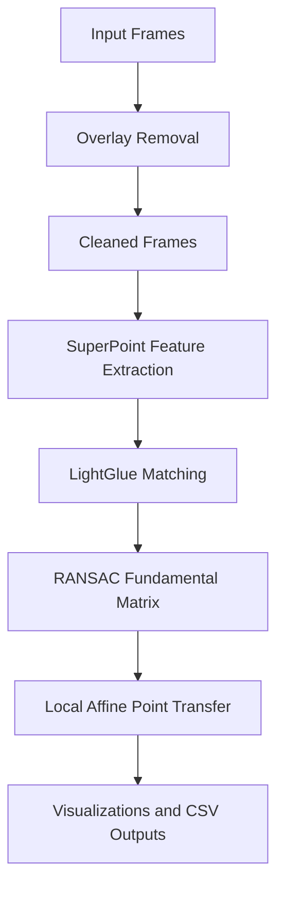

# Architecture

This document explains the full architecture of the project. It describes what each part of the system does, how data moves through
the pipeline, and where each responsibility lives in the codebase.

## 1. System Overview

The project is a deep-only computer vision pipeline for transferring a clicked
pixel from one drone frame into other frames of the same scene.

The pipeline is built around five main stages:

1. Load input frames
2. Remove fixed overlay regions
3. Extract SuperPoint features
4. Match frames with LightGlue
5. Estimate epipolar geometry and transfer the clicked point with a local affine model

The final user-facing workflow is interactive:

- the user selects a source frame
- the user clicks a source pixel
- the system computes pairwise geometry from SuperPoint + LightGlue matches
- the system predicts the corresponding point in each target frame
- results are saved as visualizations and CSV logs

## 2. Architecture Diagram Placeholder

## 3. High-Level Data Flow

## 4. Main Runtime Flow

The main runtime path is driven by `scripts/main_interactive_transfer.py`.

Its execution flow is:

1. Load frame metadata from `drones_images_input/`
2. Load cleaned frames from `outputs/clean_frames/`
3. Ask the user to choose a source frame and a source pixel
4. Extract SuperPoint features for all frames
5. For each target frame:
   - run LightGlue matching between source and target
   - estimate a fundamental matrix with RANSAC
   - filter matches near the target epipolar line
   - select the K nearest deep matches to the clicked point
   - fit a local affine transform
   - project the clicked point to the target frame
6. Save a visualization and write the result to CSV

## 5. Component Breakdown

### 5.1 Input Loading

**File:** `src/frame_loader.py`

Responsibility:

- discovers image files in `drones_images_input/`
- creates a lightweight `Frame` abstraction
- loads images lazily when needed

Why it exists:

- keeps file enumeration separate from image processing
- makes frame ordering deterministic
- avoids mixing IO logic with vision logic

### 5.2 Preprocessing / Overlay Removal

**File:** `src/preprocessing.py`

Responsibility:

- defines overlay regions
- builds masks for HUD / on-screen telemetry regions
- cleans frames by removing those regions
- saves cleaned images to `outputs/clean_frames/`

Input:

- original drone frames
- `config/overlay_regions.json`

Output:

- cleaned frames with static overlays removed

Why it exists:

- prevents the feature extractor from locking onto UI elements
- improves match quality by keeping only scene content

### 5.3 Feature Extraction

**Files:** `src/features.py`, `src/deep_features.py`

Responsibility:

- exposes the project feature extraction API
- extracts SuperPoint keypoints and descriptors
- applies optional masking so overlay regions are ignored

Design note:

- `src/features.py` acts as the public feature layer
- `src/deep_features.py` contains the model-specific SuperPoint integration

Output:

- `FeatureSet` objects per frame, containing:
  - frame name
  - image shape
  - keypoints
  - descriptors

### 5.4 Matching

**Files:** `src/matching.py`, `src/deep_matching.py`

Responsibility:

- runs pairwise descriptor matching between frames
- uses LightGlue as the only matcher
- returns match results in a format that downstream geometry code can use directly

Design note:

- `src/matching.py` provides the project-facing matching API
- `src/deep_matching.py` contains the LightGlue-specific implementation

Output:

- `FrameMatchResult` objects containing:
  - frame pair identities
  - tentative matches
  - filtered feature references

### 5.5 Geometry Estimation

**File:** `src/geometry.py`

Responsibility:

- estimates the fundamental matrix between two frames
- uses RANSAC / USAC-based robust estimation
- separates inliers from outliers
- exposes geometry results to the transfer stage

Why it matters:

- the fundamental matrix defines the epipolar constraint
- that constraint narrows the search space for correspondence transfer

Output:

- `RansacResult` objects containing:
  - estimated fundamental matrix
  - inlier matches
  - inlier counts
  - success/failure metadata

### 5.6 Local Affine Transfer

**File:** `src/local_transfer.py`

Responsibility:

- transfers a clicked point from source image to target image
- uses the estimated fundamental matrix only as a geometric guide
- keeps only deep matches near the target epipolar line
- selects the K nearest deep matches to the clicked point
- fits a local affine transform from those nearby correspondences
- applies that affine model to predict the target point

Important note:

- this is where K-nearest neighbors are used in the project
- KNN here means nearest geometric correspondences around the clicked point
- it is not descriptor KNN matching like classical FLANN/BF pipelines

### 5.7 Transfer Visualization

**File:** `src/transfer.py`

Responsibility:

- stores transfer result data
- draws the source click, epipolar line, sampled support points, and predicted target point
- produces side-by-side visual outputs for inspection

Output:

- visualization images saved under `outputs/`

## 6. Script Layer

The `scripts/` directory provides user entrypoints.

### 6.1 Pipeline Scripts

**Folder:** `scripts/pipeline/`

These scripts expose the clean submission-facing workflow:

- `run_phase1_preview.py`
- `run_phase2_clean.py`
- `run_phase3_features.py`
- `run_phase4_matching.py`
- `run_phase5_ransac.py`
- `main_interactive_transfer.py`

### 6.2 Tooling Scripts

**Folder:** `scripts/tools/`

These help define or update overlay regions.

### 6.3 Validation Scripts

**Folder:** `scripts/validation/`

These provide lightweight verification for the major pipeline stages.

## 7. Data Contracts

The project passes a small number of structured objects between stages.

### `Frame`

Defined in `src/frame_loader.py`

Represents:

- frame index
- frame file name
- frame path

### `FeatureSet`

Defined in `src/features.py`

Represents:

- extracted keypoints
- descriptors
- frame metadata

### `FrameMatchResult`

Defined in `src/matching.py`

Represents:

- pair identity
- tentative LightGlue matches
- source and target feature references

### `RansacResult`

Defined in `src/geometry.py`

Represents:

- estimated fundamental matrix
- inlier statistics
- inlier correspondences

### `TransferResult`

Defined in `src/transfer.py`

Represents:

- source point
- epipolar line
- candidate support points
- predicted target point
- score / success metadata

## 8. Input and Output Layout

### Inputs

- `drones_images_input/`
  - original drone frames
- `config/overlay_regions.json`
  - overlay region definition

### Outputs

- `outputs/clean_frames/`
  - cleaned frames after overlay removal
- `outputs/phase4_match_stats_superpoint.csv`
  - match statistics
- `outputs/phase4_matches_superpoint_*.png`
  - match visualizations
- `outputs/phase5_ransac_stats.csv`
  - geometry statistics
- `outputs/phase5_inliers_*.png`
  - inlier visualizations
- `outputs/YYYYMMDD_HHMMSS/`
  - interactive session outputs
  - source/target visualizations
  - `transfer_results.csv`

## 9. Design Principles

The architecture follows a few practical design decisions:

- **Single-responsibility modules**  
  Each file handles one main concern: loading, preprocessing, features, matching, geometry, or transfer.

- **Linear stage handoff**  
  Each stage produces a clear output consumed by the next one.

- **Deep-only consistency**  
  The system uses only SuperPoint + LightGlue to avoid branching logic and mixed pipelines.

- **Interactive final stage**  
  Offline geometry estimation supports an interactive point transfer workflow.

- **Readable outputs**  
  Every important stage writes visual or CSV outputs to support debugging and review.

## 10. Extension Points

If another engineer continues this project later, the safest extension points are:

- improving overlay region calibration in `src/preprocessing.py`
- tuning SuperPoint extraction settings in `src/deep_features.py`
- tuning LightGlue matching behavior in `src/deep_matching.py`
- adjusting RANSAC thresholds in `src/geometry.py`
- improving local affine selection logic in `src/local_transfer.py`
- improving interactive UX in `scripts/main_interactive_transfer.py`

## 11. Summary

In short, the architecture is:

- **Input frames**
- **Overlay removal**
- **SuperPoint feature extraction**
- **LightGlue pairwise matching**
- **RANSAC epipolar geometry**
- **K-nearest local affine transfer around the clicked point**
- **saved visualizations and CSV outputs**

This keeps the project simple, consistent, and easy to explain in a technical challenge submission.
