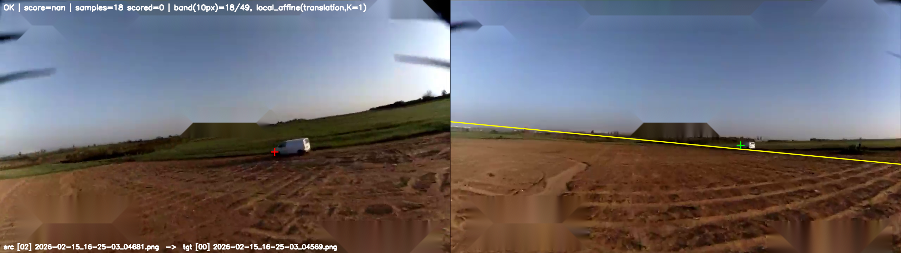
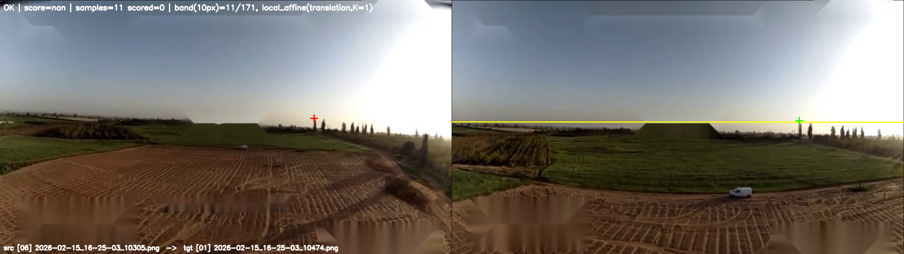
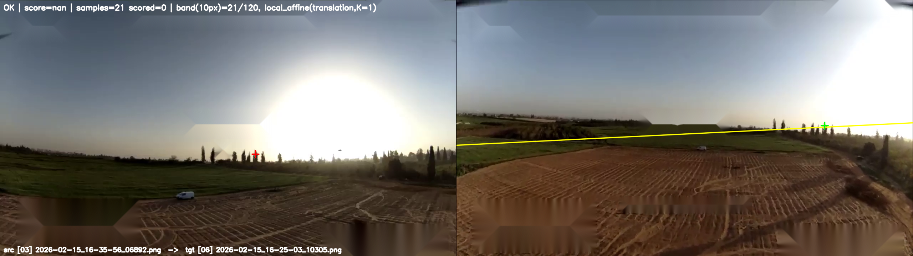
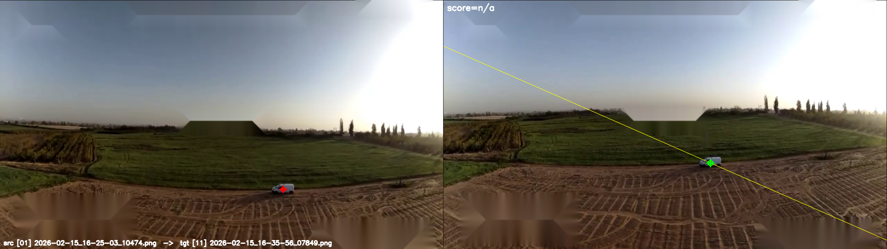
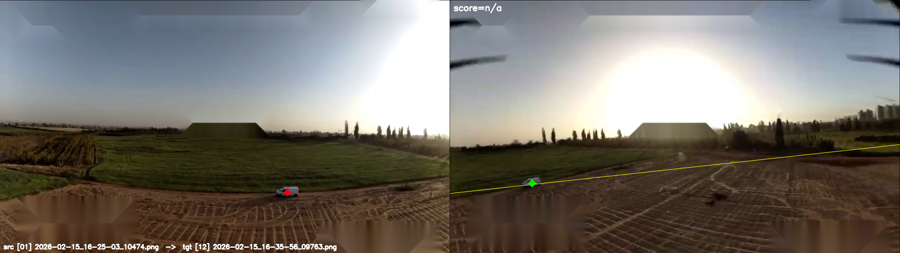
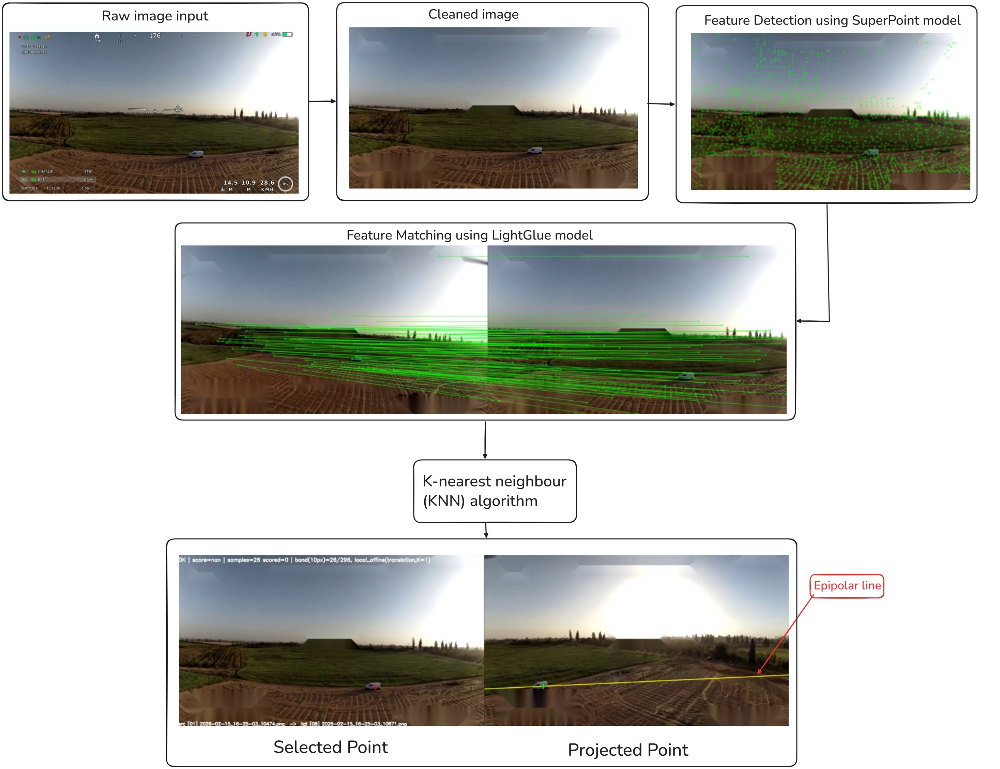

# Xtend Challenge 1 - SuperPoint + LightGlue

## Installation

1. Install `Git` and `Python 3.10+`.
2. Clone the repository and enter the project folder:

```bash
git clone https://github.com/TamirBasson/Xtend_challenge_1.git
cd Xtend_challenge_1
```

3. Create and activate a virtual environment:

```bash
# Windows PowerShell
python -m venv .venv
.venv\Scripts\Activate.ps1
python -m pip install --upgrade pip
pip install -r requirements.txt
```

```bash
# macOS / Linux
python3 -m venv .venv
source .venv/bin/activate
python3 -m pip install --upgrade pip
pip install -r requirements.txt
```

If your system does not expose `python`, use `py` on Windows or `python3` on macOS/Linux.

## Quick Start

Run the recommended interactive transfer command from the repository root:

```bash
python scripts/main_interactive_transfer.py --method superpoint --ransac-method usac_magsac --threshold 0.70 --min-inliers 15 --epipolar-band 10 --source-index 1
```

Parameter guide:
- `--method superpoint`: uses the SuperPoint + LightGlue pipeline (the only supported method - State of the art models).
- `--ransac-method usac_magsac`: robust fundamental matrix estimation method.
- `--threshold 0.70`: RANSAC reprojection error threshold in pixels.
- `--min-inliers 15`: minimum inlier matches required to accept a frame-pair geometry.
- `--epipolar-band 10`: epipolar tolerance band in pixels for local-affine match filtering.
- `--source-index 1`: selects the source frame index used for click-and-transfer.

Deep-only computer vision pipeline for:
- overlay removal
- SuperPoint feature extraction
- LightGlue matching
- RANSAC fundamental matrix estimation
- interactive local-affine point transfer (K-nearest deep matches to the click)

## Example Results

<p align="center">
  
  
  
  
  
</p>

## Architecture



The system is organized as a linear processing pipeline with one interactive
endpoint:

1. **Input loader**  
   `src/frame_loader.py` loads frame metadata and images from `drones_images_input/`.

2. **Preprocessing / overlay removal**  
   `src/preprocessing.py` builds overlay masks from `config/overlay_regions.json`
   and produces cleaned frames in `outputs/clean_frames/`.

3. **Feature extraction (deep-only)**  
   `src/features.py` delegates to `src/deep_features.py` to extract SuperPoint
   keypoints and descriptors on cleaned frames.

4. **Pairwise matching (deep-only)**  
   `src/matching.py` delegates to `src/deep_matching.py`, where LightGlue
   matches SuperPoint descriptors between frame pairs.

5. **Epipolar geometry estimation**  
   `src/geometry.py` estimates the fundamental matrix with RANSAC and returns
   inlier-supported geometry per pair.

6. **Interactive transfer service**  
   `scripts/main_interactive_transfer.py` uses:
   - SuperPoint + LightGlue matches
   - RANSAC fundamental matrix
   - local affine transfer from `src/local_transfer.py`
   
   to transfer a clicked source pixel into each target frame.

7. **Visualization and persistence**  
   `src/transfer.py` handles transfer result visualization, while scripts write
   CSV/image artifacts under `outputs/`.

## Project Structure

```text
Xtend_challenge_1/
├── config/
│   └── overlay_regions.json
├── drones_images_input/
├── outputs/
├── scripts/
│   ├── pipeline/
│   │   ├── run_phase1_preview.py
│   │   ├── run_phase2_clean.py
│   │   ├── run_phase3_features.py
│   │   ├── run_phase4_matching.py
│   │   ├── run_phase5_ransac.py
│   │   └── main_interactive_transfer.py
│   ├── tools/
│   └── validation/
├── src/
├── requirements.txt
└── README.md
```


## Dependencies

- `numpy>=1.24`
- `opencv-python>=4.8`
- `matplotlib>=3.7`
- `torch>=2.0`
- `lightglue @ git+https://github.com/cvg/LightGlue.git`

## Run Commands

```bash
python scripts/pipeline/run_phase1_preview.py
python scripts/pipeline/run_phase2_clean.py
python scripts/pipeline/run_phase3_features.py
python scripts/pipeline/run_phase4_matching.py
python scripts/pipeline/run_phase5_ransac.py
python scripts/pipeline/main_interactive_transfer.py --source-index 1
```

## Inputs

- `drones_images_input/*`
- optional: `config/overlay_regions.json`

## Outputs

- `outputs/clean_frames/*.png`
- `outputs/phase4_match_stats_superpoint.csv`
- `outputs/phase4_matches_superpoint_*.png`
- `outputs/phase5_ransac_stats.csv`
- `outputs/phase5_inliers_*.png`
- `outputs/YYYYMMDD_HHMMSS/transfer_results.csv`

## Validation

```bash
python scripts/validation/validate_phase1.py
python scripts/validation/validate_phase2.py
python scripts/validation/validate_phase3.py
python scripts/validation/validate_phase4.py
python scripts/validation/validate_phase5.py
```
